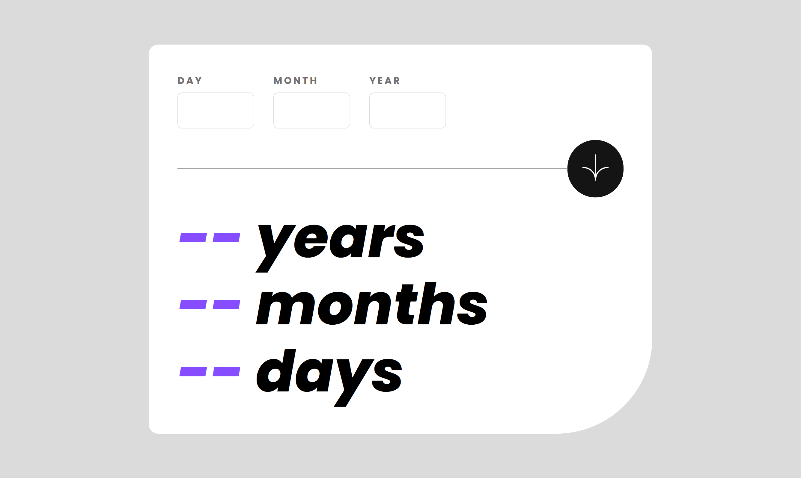

# Frontend Mentor - Rfm-age-calculator-app

Esta es una solución al [desafío del age-calculator-app en Frontend Mentor](https://www.frontendmentor.io/challenges/age-calculator-app-dF9DFFpj-Q/hub). Los desafíos de Frontend Mentor lo ayudan a mejorar sus habilidades de codificación mediante la creación de proyectos realistas.

- Solution URL: [Github](https://github.com/ayrtonbolwal/fm-age-calculator-app)
- Live Site URL: [Netifly](https://ayrtonbolwal-age-calculator.netlify.app/)

## Mi Proceso

- [ ] Semántica de HTML5
- [ ] Preparación entorno SASS
- [ ] Despliegue CSS
- [ ] Técnicas de Flexbox
- [ ] JS

## Cosas que aprendí

- Entrega de etapas con Git
- SASS despliegue

## Recursos recomendados

- [Position absolute](https://developer.mozilla.org/en-US/docs/Web/CSS/position)
- [Flex](https://developer.mozilla.org/es/docs/Web/CSS/CSS_flexible_box_layout/Basic_concepts_of_flexbox)
- [Grid](https://developer.mozilla.org/es/docs/Web/CSS/grid)
- [SASS](https://sass-lang.com/documentation/)

Happy Coding! 👾🖖
Tráiganme a SASS 🔨⚡😎
